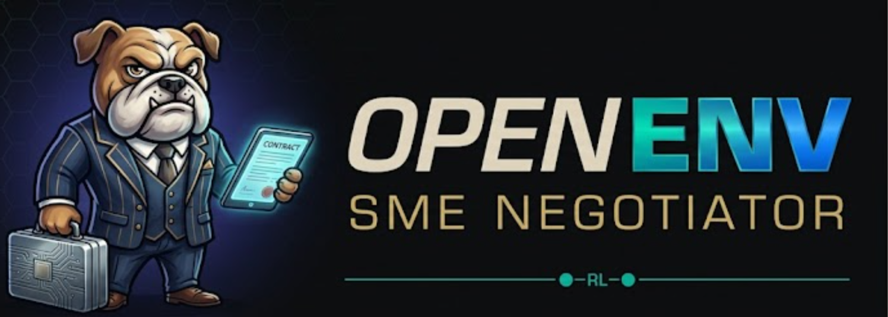

> [!IMPORTANT]
> **TL;DR** -- SME Negotiator is a liquidity-first OpenEnv environment for Indian MSME payment-term negotiations with deterministic grading, tool-aware treasury workflows, and a truthful legacy public server surface.
> Public legacy reference benchmark: **0.52 overall** on `payment-terms-*` single-deal tasks.
> The manifest-facing OpenEnv surface stays the legacy HTTP path; the in-process liquidity path is the canonical training/demo artifact for Theme #2 and Theme #3.1, and now emits explicit `[TERMINAL_REWARD]`, `[VERIFIABLE_REWARD]`, `[PERIOD_SUMMARY]`, and terminal `termination_reason=` / `defaulted_sme_count=` fields.
> Set `INFERENCE_AGENT_MODE=heuristic` for a deterministic baseline path that does not depend on router quality.
> For public HF router demos, prefer a long-context chat model such as `Qwen/Qwen2.5-7B-Instruct-1M`; keep `.env` overrideable and use the same `inference_results.json -> judge_pack` pipeline for every README metric.
> The Colab submission profile now saves reviewer-facing artifacts into `outputs/grpo_sme_liquidity_colab/`, including `reward_curve.png`, `training_dashboard.png`, `policy_comparison.png`, and `eval_summary.json`. Refresh those files by rerunning `notebooks/colab_grpo_sme_liquidity.ipynb` before cutting a submission.

## Judge Quick Links

| Resource | Link |
|---|---|
| HF Space (live legacy environment) | [SME Negotiator Space](https://huggingface.co/spaces/Omkarchaithanya/sme-negotiator) |
| GRPO Training Colab | [notebooks/colab_grpo_sme_liquidity.ipynb](notebooks/colab_grpo_sme_liquidity.ipynb) |
| Submission training dashboard | [outputs/grpo_sme_liquidity_colab/training_dashboard.png](outputs/grpo_sme_liquidity_colab/training_dashboard.png) |
| Submission policy comparison | [outputs/grpo_sme_liquidity_colab/policy_comparison.png](outputs/grpo_sme_liquidity_colab/policy_comparison.png) |
| Submission eval summary | [outputs/grpo_sme_liquidity_colab/eval_summary.json](outputs/grpo_sme_liquidity_colab/eval_summary.json) |
| Current inference summary artifact | [inference_results.json](inference_results.json) |
| Full evaluation notes | [EVALUATION.md](EVALUATION.md) |
| OpenEnv manifest | [openenv.yaml](openenv.yaml) |

<p align="center">
  
</p>

<p align="center">
  <strong>Train agents to defend SME liquidity in real-world payment-term negotiations.</strong>
</p>

<p align="center">
  <a href="https://huggingface.co/spaces/Omkarchaithanya/sme-negotiator">
    
  </a>
  <a href="https://www.python.org/downloads/">
    
  </a>
  <a href="https://fastapi.tiangolo.com/">
    
  </a>
  <a href="https://huggingface.co/openenv/">
    
  </a>
  <a href="LICENSE">
    
  </a>
</p>

**OpenEnv SME Negotiator** is an OpenEnv-compliant reinforcement learning and agent benchmark for B2B payment-term negotiation. It turns a painfully common SME reality into a reproducible environment: the supplier ships now, the buyer wants 60–90+ day settlement, the SME still has to pay staff, vendors, GST, rent, and debt on time.

If you want an environment where an agent must balance price, payment days, working-capital stress, TReDS, late-payment protection, and dynamic discounting under deterministic grading, this is it.

[GitHub](https://github.com/SkandaGanesha1/ENV) · [Hugging Face Space](https://huggingface.co/spaces/Omkarchaithanya/sme-negotiator) · [OpenEnv Docs](https://huggingface.co/docs/openenv) · [Setup](SETUP.md) · [Evaluation](EVALUATION.md) · [Troubleshooting](TROUBLESHOOTING.md) · [Index](INDEX.md)

---

## 🚨 The Crisis This Solves

<div align="center">

| 📊 Metric | 🔢 Number | 🗓️ Source |
|---|---|---|
| **Delayed MSME receivables (2026 Eco Survey)** | **₹8.1 lakh crore** | [Economic Times coverage](https://economictimes.indiatimes.com/small-biz/sme-sector/rs-8-1-lakh-crore-stuck-in-delayed-msme-payments-eco-survey-2026/articleshow/127765852.cms?from=mdr) |
| **Razorpay “Fix My Itch” itch score** | 82.8 / 100 | [Fix My Itch by Razorpay](https://razorpay.com/m/fix-my-itch/) |
| **Peak delayed payments (2022)** | ₹10.7 lakh crore | [GAME–FISME–C2FO White Paper 3.0](https://www.businesstoday.in/industry/story/rs-81-lakh-crore-stuck-in-dues-msme-growth-hinges-on-dispute-reform-warns-white-paper-422710-2026-02-26) |
| **Samadhaan portal — applications filed** | 2,35,000+ applications | [MSME Samadhaan – Dashboard / all-amount reports](https://samadhaan.msme.gov.in/MyMsme/MSEFC/MSEFC_ReportAllAmount.aspx) |
| **Amount payable across cases** | ~₹50,000 crore | [MSME Samadhaan – Pending Amount Report](https://samadhaan.msme.gov.in/MyMsme/MSEFC/MSEFC_ReportAllPendingAmount.aspx) |
| **MSMEs in India** | 6.4+ crore enterprises | [PIB / Economic Survey MSME overview](https://www.pib.gov.in/PressReleasePage.aspx?PRID=2219984) |
| **Employment supported** | 30+ crore people | [PIB / Economic Survey MSME overview](https://www.pib.gov.in/PressReleasePage.aspx?PRID=2219984) |
| **Share of India’s GDP** | ~31% | [PIB / Economic Survey MSME overview](https://www.pib.gov.in/PressReleasePage.aspx?PRID=2219984) |
| **Share of India’s exports** | ~48% | [PIB / Economic Survey MSME overview](https://www.pib.gov.in/PressReleasePage.aspx?PRID=2219984) |
| **TReDS invoice discounting growth** | ₹0 → ₹2.4 lakh crore | [RBI TReDS statistics](https://www.rbi.org.in/Scripts/TREDSStatisticsView.aspx?TREDSid=40) |

</div>

<p align="center">
  
  
</p>

> [!IMPORTANT]
> **The core pain:** A supplier ships goods. The buyer demands 60–90+ day settlement. The SME must still pay staff, vendors, GST, rent, and loan EMIs within ~30 days. That cash-flow gap — multiplied across crores of enterprises — is what this environment makes trainable.

> [!NOTE]
> Under **Section 43B(h)** of the Income Tax Act (effective FY 2023–24), buyers who delay MSME payments beyond 45 days lose their tax deduction on that expense. Under **Sections 15–24 of the MSMED Act, 2006**, buyers are liable for **compound interest at 3× the RBI bank rate** on overdue amounts.[cite:7][cite:10] Despite these protections and schemes like MSME Samadhaan and ODR, delayed MSME payments still exceed ₹8.1 lakh crore.[cite:16][cite:10][cite:22][cite:24]

---

## 🏆 Judge Scoring Map

<div align="center">

| Criterion | What We Built | Where to Verify |
|---|---|---|
| **Real-world utility (30%)** | Models a live multi‑lakh‑crore economic crisis in B2B payment-term negotiations. Designed to be immediately useful to fintech RL labs, MSME policy researchers, and agent benchmark suites. | Crisis stats above; Economic Survey 2025–26; MSME Samadhaan and RBI TReDS links; Razorpay “Fix My Itch”.[cite:16][cite:10][cite:14][cite:19][cite:23] |
| **Task & grader quality (25%)** | 3 tasks (easy/medium/hard) with deterministic graders in `graders.py`. All terminal scores are normalized to `[0.0, 1.0]`. Hard task couples multi‑buyer dynamics, dynamic discounting, and financing tradeoffs to resist trivial strategies. | [`sme_negotiator_env/graders.py`](sme_negotiator_env/graders.py) · [`sme_negotiator_env/task_config.py`](sme_negotiator_env/task_config.py) |
| **Environment design (20%)** | Clean `reset()` → `step()` loop with rich structured observations (liquidity threshold, working-capital gap, buyer power, TReDS availability). Shaped partial rewards plus deterministic terminal rewards and clear episode boundaries. | [`server/sme_environment.py`](server/sme_environment.py) · [`sme_negotiator_env/models.py`](sme_negotiator_env/models.py) |
| **Code quality & spec compliance (15%)** | `openenv.yaml` present; OpenEnv HTTP + WebSocket API on port `7860`; Dockerfile builds and runs; Hugging Face Space live. Typed Pydantic models throughout and a `pytest` suite for environment and baseline behavior. | [`openenv.yaml`](openenv.yaml) · [`docker/Dockerfile`](docker/Dockerfile) · [`tests/`](tests/) · HF Space link above |
| **Creativity & novelty (10%)** | First OpenEnv environment focused on B2B payment-term negotiation. Reward combines price × time × financing × legal clauses. Anchored in Indian MSME policy while remaining generalizable as a negotiation benchmark. | Task ladder below · `graders.py` reward logic · policy and TReDS links |

</div>

---

## 💡 Why This Benchmark Is Unique

✅ **This benchmark:** Survive a real B2B payment-term crisis with legal, financial, and relational tradeoffs — graded by deterministic code, not vibes.

### Five properties that set this apart

<details>
<summary><b>1️⃣ &nbsp;Economic realism — the observation space is a real CFO's dashboard</b></summary>

Every field in `NegotiationObservation` maps to a real SME decision variable:

| Field | Real-world meaning |
|---|---|
| `buyer_price` | Buyer's opening offer per unit |
| `buyer_days` | Buyer's proposed settlement period |
| `liquidity_threshold_days` | Max days the SME can survive before cash crisis |
| `working_capital_gap` | Shortfall the SME must bridge during the wait |
| `supplier_payment_days` | When the SME must pay its own upstream vendors |
| `interest_rate` | Cost of bridging finance if the SME borrows |
| `buyer_power` | Relative negotiating leverage of the buyer |
| `treds_available` | Whether TReDS discounting is accessible |

An agent that scores well here has genuinely learned to reason about liquidity, not just to pattern-match “say 30 days.”

</details>

<details>
<summary><b>2️⃣ &nbsp;Deterministic, inspection-friendly grading</b></summary>

- All graders live in `sme_negotiator_env/graders.py` and map outcomes to `[0.0, 1.0]`.
- No LLM-as-judge, no randomness in scoring — the same trajectory always gets the same score.
- Graders are written for auditability: they expose how each lever (price, days, clauses, financing) affects the final score.

</details>

<details>
<summary><b>3️⃣ &nbsp;Progressive difficulty — the hard task genuinely resists frontier models</b></summary>

```text
EASY   → single lever (compress payment days)
MEDIUM → two levers (days + legal clause)
HARD   → four levers (price × days × TReDS × dynamic discounting NPV)
         in a hostile two-buyer setting with compressed price margin
```

On hard mode, a naive “always accept” agent scores ~0. A “always propose 30 days” agent also scores ~0. The agent must reason about the NPV of early payment vs. discount cost vs. buyer acceptance probability — a genuinely non-trivial sequential decision problem.

</details>

<details>
<summary><b>4️⃣ &nbsp;Policy-class agnostic — RL, LLM, heuristic, and hybrid agents all fit</b></summary>

The environment ships with:

- A **typed Python client** (`SMENegotiatorEnv`) for RL and heuristic policies
- A **generic OpenEnv client** (`GenericEnvClient`) for dict-based policies
- An **LLM baseline** in `inference.py` targeting any OpenAI-compatible endpoint
- **HTTP + WebSocket APIs** for cross-language agent integrations
- **In-process mode** (`OPENENV_IN_PROCESS=1`) for zero-latency local RL loops

</details>

<details>
<summary><b>5️⃣ &nbsp;Regulatory anchoring — the mechanics reflect live Indian law</b></summary>

The benchmark is not built on invented rules. Every constraint maps to a real statute or ecosystem mechanism:

- **45-day payment window** → MSMED Act, 2006, Sections 15–24 (delayed payment obligations)
- **Compound interest at 3× RBI rate** → MSMED Act buyer liability for overdue bills
- **TReDS “without recourse” financing** → RBI-defined Trade Receivables Discounting System FAQ[cite:14]
- **Tax disallowance for late payments** → Section 43B(h), Income Tax Act
- **Dynamic discounting** → Early-payment platforms (e.g., C2FO, M1xchange, RXIL) widely used in India

</details>

---

## 🗞️ Live Evidence: News & Official Data

> Real-world signals that confirm this is a genuine, unsolved problem — not a classroom exercise.

<details>
<summary><b>📰 &nbsp;News Coverage & Market Signal — click to expand</b></summary>

<br/>

| Source | Headline | Date |
|---|---|---|
| 🏛️ **Economic Survey 2025–26** | “Delayed payments remain a critical MSME challenge — estimated ₹8.1 lakh crore locked up” | Jan 2026[cite:16][cite:10][cite:22][cite:24] |
| 📰 **Business Standard / others** | “Delayed payments continue to hit MSMEs, ₹8.1 trillion stuck: Eco Survey” | Jan 2026[cite:16][cite:24] |
| 📰 **Economic Times** | “Rs 8.1 lakh crore stuck in delayed MSME payments: Economic Survey 2026” | Jan 2026[cite:10] |
| 📰 **Financial Express** | “Delayed payments to MSMEs cross Rs 50,000 crore despite govt push” | 2024 |
| 🔬 **GAME–FISME–C2FO Report 3.0** | “Delayed receivables at ₹7.34 lakh crore (Mar 2024), still 4.6% of India’s GVA” | Nov 2025[cite:24] |
| 🏦 **Razorpay Fix My Itch** | “Why can’t SMEs negotiate favorable payment terms with large buyers?” — itch score 82.8 | 2024[cite:23] |
| 🏛️ **MSME Samadhaan Portal** | 2.3–2.5 lakh applications filed; ~₹50,000 crore in payable amounts across cases | 2025–26 portal reports[cite:11][cite:19] |

</details>

<details>
<summary><b>🏛️ &nbsp;Official Government & Regulatory Links — click to expand</b></summary>

<br/>

**Legal framework:**

- [MSME Samadhaan delayed payment portal](https://samadhaan.msme.gov.in/) — Sections 15–24, MSMED Act 2006
- [MSME ODR portal](https://odr.msme.gov.in/) — Online Dispute Resolution for delayed payments
- [Income Tax Section 43B(h)](https://incometaxindia.gov.in/Charts%20%20Tables/Provisions-applicable-to-business-entities.htm) — tax deduction disallowance for late MSME payments

**TReDS and financing:**

- [RBI FAQ: Trade Receivables Discounting System](https://www.rbi.org.in/scripts/FAQView.aspx?Id=132)
- [RBI circular: Expanding the scope of TReDS](https://www.rbi.org.in/scripts/BS_CircularIndexDisplay.aspx?Id=12510)
- [RBI TReDS statistics](https://www.rbi.org.in/Scripts/TREDSStatisticsView.aspx?TREDSid=40)

**Policy reports:**

- [Economic Survey 2025–26, Chapter 8](https://www.indiabudget.gov.in/economicsurvey/doc/eschapter/echap08.pdf)
- [PIB: MSME year-end review with ODR portal launch note](https://www.pib.gov.in/PressReleasePage.aspx?PRID=2209712)
- [PIB: Parliament reply covering Samadhaan, ODR, and TReDS](https://www.pib.gov.in/PressReleasePage.aspx?PRID=2153722)

</details>

<details>
<summary><b>📊 &nbsp;Delayed Payments Timeline — the problem’s scale over time</b></summary>

<br/>

```text
Year        Delayed MSME receivables     Comment
────────────────────────────────────────────────────────
2022        ₹10.7 lakh crore (peak)      GAME–FISME–C2FO White Paper 3.0
2023        ₹ 8.27 lakh crore            ▼ reduction but still huge
Mar 2024    ₹ 7.34 lakh crore            ▼ still ~4.6% of India’s GVA
Jan 2026    ₹ 8.1  lakh crore            ▲ Eco Survey estimate remains massive
2025–26     ~₹50,000 crore               Samadhaan pending cases only
```

**Interpretation:** Despite policy pressure (TReDS, Section 43B(h), Samadhaan, ODR), the structural problem — **unequal bargaining power in B2B payment-term negotiations** — remains unsolved.[cite:16][cite:10][cite:19][cite:24] This is exactly the decision problem this environment benchmarks.

</details>

---

## 🎯 Task Ladder

<div align="center">

```text
┌─────────────────────────────────────────────────────────────────────────┐
│                        TASK DIFFICULTY LADDER                          │
├──────────────────┬──────────────────────┬───────────────────────────────┤
│  🟢 EASY         │  🟡 MEDIUM           │  🔴 HARD                      │
│  payment-terms-  │  payment-terms-      │  payment-terms-hard          │
│  easy            │  medium              │                               │
├──────────────────┼──────────────────────┼───────────────────────────────┤
│ Opens: 100 INR   │ Opens: 100 INR       │ Opens: 96 INR / 100 days      │
│        / 90 days │        / 60 days     │ Setting: hostile two-buyer    │
├──────────────────┼──────────────────────┼───────────────────────────────┤
│ Goal: compress   │ Goal: tighten terms  │ Goal: maximize NPV via        │
│ days ≤ 60        │ + add late-payment   │ dynamic discounting           │
│                  │ penalty clause       │ (propose_dynamic_discounting) │
├──────────────────┼──────────────────────┼───────────────────────────────┤
│ Levers: 1        │ Levers: 2            │ Levers: 4                     │
│ (payment days)   │ (days + clause)      │ (price × days × TReDS ×      │
│                  │                      │  discount rate)               │
├──────────────────┼──────────────────────┼───────────────────────────────┤
│ Terminal: 1.0 if │ Terminal: 1.0 if     │ Terminal: NPV-delta score     │
│ days ≤ 60        │ days ≤ 45 + clause   │ vs status quo                 │
│ Partial: yes     │ Partial: yes         │ TReDS changes floor, not      │
│                  │                      │ the terminal score alone      │
└──────────────────┴──────────────────────┴───────────────────────────────┘
```

</div>

| Task | Opening state | What the agent must do | Full-credit signal |
|------|---------------|------------------------|--------------------|
| `payment-terms-easy` | Buyer opens at `100 INR / 90 days` | Compress terms toward the SME liquidity threshold | Reach a deal with agreed days `<= 60` |
| `payment-terms-medium` | Buyer opens at `100 INR / 60 days` | Tighten terms and use a late-payment penalty clause | Reach a deal with agreed days `<= 45`, with stronger partial credit if the clause is included |
| `payment-terms-hard` | Buyer opens at `96 INR / 100 days` in a hostile two-buyer setting | Negotiate dynamic discounting and manage financing tradeoffs | Improve NPV versus the status quo with `propose_dynamic_discounting=true` |

> [!WARNING]
> **Hard-mode trap for naive agents:** Setting `use_treds=true` modifies the simulation by lowering the buyer day floor, but the terminal score is **not** earned by TReDS alone. To earn hard-task credit, the agent must negotiate **dynamic discounting** with a coherent `dynamic_discount_annual_rate`. Agents that simply “accept + use_treds” will score close to 0 on the hard task.

---

## ⚙️ Environment Design

### Observation space

`NegotiationObservation` — all fields typed via Pydantic:

```python
class NegotiationObservation(BaseModel):
    buyer_price: float                  # INR per unit — buyer's current offer
    buyer_days: int                     # settlement days — buyer's current demand
    liquidity_threshold_days: int       # SME's hard limit before cash crisis
    working_capital_gap: float          # INR shortfall to bridge
    supplier_payment_days: int          # when SME must pay its own suppliers
    interest_rate: float                # cost of bridging finance (annual %)
    buyer_power: float                  # 0.0–1.0 buyer negotiating leverage
    treds_available: bool               # TReDS accessible in this episode?
    round_number: int                   # current negotiation round
    max_rounds: int                     # episode length cap
```

### Action space

`NegotiationAction` — all fields typed and validated on intake:

```python
class NegotiationAction(BaseModel):
    action_type: Literal["propose", "accept", "reject"]
    price: float                                  # proposed price in INR/unit
    payment_days: int                             # proposed settlement days
    use_treds: bool = False                       # invoke TReDS financing
    reason: str = ""                              # optional free-text justification
    propose_late_payment_penalty_clause: bool = False   # MEDIUM task lever
    propose_dynamic_discounting: bool = False           # HARD task lever
    dynamic_discount_annual_rate: float = 0.0           # HARD task lever
```

> [!NOTE]
> `NegotiationAction` has **no** `message=` field. Use `reason` for any free-text explanation. This is intentional — it forces the agent to express its strategy through structured fields, enabling clean deterministic grading.

### Reward shaping

- **Partial (step) rewards:** positive signal for reducing the gap between `buyer_days` and `liquidity_threshold_days`, penalty for widening it — ensures the agent gets learning signal even in long episodes.
- **Terminal reward:** deterministic score from `graders.py`, always ∈ `[0.0, 1.0]`.
- **Episode boundary:** triggered by `accept`, `reject`, or `max_rounds` exhaustion.
- **No purely sparse rewards:** every step yields a signal; the agent is never flying blind.

---

## 🏗️ Architecture

For many SMEs, the hardest part of a sale is not winning the order — it is surviving the cash-flow gap after delivery. Large buyers can push payment cycles far beyond the supplier’s comfort zone while the supplier still needs to pay upstream vendors in roughly 30 days, fund payroll, manage borrowing costs, and preserve the commercial relationship. That creates a negotiation problem that is economically serious, strategically messy, and ideal for agent evaluation.[cite:16][cite:10][cite:22][cite:24]

This repository turns that pain point into a benchmark:

- A deterministic negotiation environment for RL, LLM agents, policy search, and evaluation.
- A typed Python client plus OpenEnv HTTP and WebSocket surfaces.
- Three progressively harder tasks covering term compression, contractual protection, and financing structure.
- A baseline runner that emits audit-friendly `[START]`, `[STEP]`, and `[END]` logs.

```text
LLM / heuristic / RL agent
          |
          v
SMENegotiatorEnv or GenericEnvClient
          |
          v
FastAPI + OpenEnv app  (port 7860)
          |
          v
SMENegotiatorEnvironment
          |
          +-- task_config.py
          +-- graders.py
          +-- typed state / observation models
```

The environment exposes:

- Partial step rewards for negotiation progress.
- Deterministic terminal rewards from task-specific graders.
- Rich observations with buyer terms, liquidity thresholds, working-capital gap, buyer power, and financing context.
- A state model that can be serialized for evaluation and replay.

---

## 🚀 Quick Start

Runtime: **Python 3.11+**. `uv` is the fastest path.

### Install

```bash
cp .env.example .env
# PowerShell: Copy-Item .env.example .env

uv sync
```

If you also want dev dependencies:

```bash
uv sync --extra dev
```

If you also want the Stage 5 RL training stack:

```bash
uv sync --extra rl
```

For the optional Unsloth path:

```bash
uv sync --extra rl --extra rl-unsloth
```

### Run the environment server

```bash
uv run server
```

The server listens on:

```text
http://127.0.0.1:7860
```

### Run the baseline agent

In another terminal:

```bash
uv run python inference.py
```

### Using the HF Router (hackathon standard)

```bash
export API_BASE_URL="https://router.huggingface.co/v1"
export HF_TOKEN="hf_xxx"
export MODEL_NAME="Qwen/Qwen2.5-7B-Instruct"
uv run python inference.py
```

Compatibility fallback for generic OpenAI-style examples:

```bash
export OPENAI_API_KEY="hf_xxx"
```

### Run without a separate server

```bash
export OPENENV_IN_PROCESS=1
# PowerShell: $env:OPENENV_IN_PROCESS="1"

uv run python inference.py
```

Results are written to `inference_results.json`. In liquidity mode the task and
overall summaries now also include `avg_verifiable_reward`,
`avg_tool_bonus`, `avg_tool_call_count`, `avg_tool_effective_count`,
`avg_final_payment_days`, `avg_resolved_deal_count`, and
`timeout_or_stepcap_rate`.

## Stage 5 RL Training

Stage 5 adds an in-process RL training layer under `rl/` without changing the
live OpenEnv server wiring:

- `server.app` still serves `SMENegotiatorEnvironment`
- `openenv.yaml` is unchanged
- `rl/bridge.py` trains directly against `SMELiquidityEnvironment`
- rubric scoring remains optional and training-side only

Dry-run the canonical TRL setup:

```bash
uv run --extra rl python -m rl.train_grpo_trl --dry-run
```

Dry-run the optional Unsloth setup:

```bash
uv run --extra rl --extra rl-unsloth python -m rl.train_grpo_unsloth --dry-run
```

For a local judge-facing moderate run:

```bash
export TRAINING_LOG_BACKEND=none
uv run --extra rl python -m rl.train_grpo_trl --num-samples 128 --output-dir outputs/grpo_sme_liquidity_trl
```

Each completed run now writes `reward_curve.png`, `training_dashboard.png`,
`policy_comparison.png`, and `eval_summary.json` into the chosen output
directory. The notebook submission profile uses
`outputs/grpo_sme_liquidity_colab/` as the canonical artifact location.

To build the judge-facing evidence bundle from a real `inference_results.json`:

```bash
python -m rl.judge_pack --results-file inference_results.json --output-dir outputs/judge_pack
```

That command writes `judge_summary.json`, `judge_results.md`, `reward_curve.png`,
`before_after_excerpt.md`, and baseline/trained transcript artifacts into
`outputs/judge_pack/`. Copy README tables from `judge_summary.json`; do not
hand-write metrics.

## Stage 6 Self-Play

Stage 6 adds three training-time self-improvement layers on the liquidity path:

- policy-snapshot self-play for buyer and financier opponents
- adaptive curriculum over macro horizon and deterministic volatility
- persona-weighted external rubric overlays plus a minimal preference-data path

These features live under `rl/` and `docs/SELF_PLAY.md`. They do not change:

- `server.app`
- `openenv.yaml`
- live OpenEnv behavior
- deterministic in-env reward and grader semantics

## Modes Of Use

| Mode | Entry Point | What It Covers |
|---|---|---|
| Live OpenEnv baseline | `server.app` + `openenv.yaml` | Legacy single-deal `payment-terms-*` tasks over the public HTTP/WebSocket API |
| In-process liquidity training | `rl/bridge.py` + `SMELiquidityEnvironment` | Multi-deal world state, macro periods, deterministic tools, GRPO training, self-play, curriculum |

## Hackathon Theme Map

| Layer | Theme | What This Repo Implements |
|---|---|---|
| Core environment | Theme 1 | Multi-agent liquidity world with SME, buyers, financier, and deal state |
| Long horizon | Theme 2 | Macro periods, cashflow settlement, defaults, and deterministic planning |
| Professional workflow tools | Theme 3.1 | `QUERY_TREDS`, `CHECK_COMPLIANCE`, `RUN_CASHFLOW_SIM` as explicit actions |
| Self-improvement | Theme 4 | Self-play opponents, curriculum, and persona-based rubric overlays in RL scripts |

## Architecture

```text
                         LIVE OPENENV SERVER
                   server.app -> SMENegotiatorEnvironment
                              |
                              v
                   payment-terms-easy / medium / hard


                         IN-PROCESS RL / DEMO PATH
                   rl.bridge / rl.demo / TRL / Unsloth
                              |
                              v
                    +-----------------------------+
                    |     SMELiquidityEnvironment |
                    |-----------------------------|
                    | WorldState                  |
                    | - SME accounts              |
                    | - Buyers                    |
                    | - Financier                 |
                    | - Deals across periods      |
                    +-----------------------------+
                      |            |            |
                      v            v            v
                 Negotiation   Cashflow      Compliance
                   engine      settlement      checks
                      |            |            |
                      +------------+------------+
                                   |
                                   v
                     Deterministic tools and pure graders
```

## Reward Design

- Deterministic terminal RLVR reward is computed from verifiable outcome terms:
  solvency, liquidity-buffer adequacy, NPV versus baseline, and legal compliance.
- Deterministic shaping rewards capture local negotiation progress such as
  reducing working-capital gap, improving payment terms, and better receivable /
  payable alignment.
- Optional rubric overlays and persona-weighted rewards exist only in the RL
  orchestration layer and never change the environment's deterministic grading.

For more detail, see [EVALUATION.md](EVALUATION.md).

## Why Rewards Can Look Wrong

By default, `python inference.py` runs the in-process liquidity path so Theme
1 / 2 / 3.1 features are visible in runtime logs.

- The per-step `reward=` values in `[STEP]` logs are dense shaping rewards, not
  the full long-horizon liquidity RL objective.
- If a macro period has no open deals left, the liquidity runner now
  auto-selects `advance_period` instead of asking the model to act on a null
  deal.
- `[VERIFIABLE_REWARD]` prints the canonical terminal breakdown when it is
  available and otherwise prints `breakdown=unavailable` instead of fake zeroes.
- `[TERMINAL_REWARD]` isolates the final deterministic verifiable reward so the
  episode-ending score is visible separately from the shaping curve.
- Those shaping rewards can decline across steps when the buyer keeps conceding
  and the SME proposal stays nearly flat, because the marginal improvement vs
  the buyer's current terms gets smaller.
- The terminal score can still be high even after descending intermediate
  shaping rewards.
- Theme 1 / 2 / 3.1 features are visible through the in-process liquidity
  runner. Theme 4 overlays remain training-layer features.

For reward debugging, use:

- `INFERENCE_REWARD_MODE=legacy+shadow_rlvr` to print a shadow Stage 2-style
  report alongside the unchanged legacy reward (legacy mode only).
- `INFERENCE_ENV_MODE=legacy OPENENV_IN_PROCESS=0` to run the live single-deal
  server contract.
- `INFERENCE_ENV_MODE=liquidity OPENENV_IN_PROCESS=1` to run the multi-deal
  liquidity path with tool, planning, and macro-period actions visible.

## Results

Checked-in judge-facing artifacts today:

| Artifact | Overall value | Notes |
|---|---|---|
| Legacy single-deal reference benchmark | `0.52` overall score | Public server-compatible `payment-terms-*` baseline from `EVALUATION.md` |
| Checked-in liquidity smoke artifact | `0.00` overall score / `0.0000` mean reward | Current `inference_results.json` confirms the in-process liquidity path, explicit terminal reward logs, and additive summary metrics |

## Real Training Evidence

Run profile: `submission`
Task: `liquidity-correlation-hard`
Artifacts: `outputs/grpo_sme_liquidity_colab/training_dashboard.png`, `outputs/grpo_sme_liquidity_colab/policy_comparison.png`, `outputs/grpo_sme_liquidity_colab/eval_summary.json`

| Metric | Base model | Trained checkpoint |
|---|---|---|
| Mean total reward | `policies.base.mean_total_reward` | `policies.trained.mean_total_reward` |
| Mean verifiable reward | `policies.base.mean_verifiable_reward` | `policies.trained.mean_verifiable_reward` |
| Success rate | `policies.base.success_rate` | `policies.trained.success_rate` |
| Mean final payment days | `policies.base.mean_final_payment_days` | `policies.trained.mean_final_payment_days` |


Caption: Multi-panel training diagnostics from the real environment-connected GRPO run, with reward, rollout diversity, and format-quality metrics on labeled axes.


Caption: Fixed-seed before/after comparison using the same task, horizon, and evaluation budget for the base model and the trained checkpoint.

Example before/after trajectory excerpt:

```text
Before training / heuristic:
- opens first deal
- queries TReDS when tenor is outside liquidity comfort
- accepts current buyer terms to avoid macro default

After a tiny GRPO demo:
- queries TReDS earlier on stressed deals
- resolves open deals with fewer wasted macro steps
- advances periods only after clearing the immediate negotiation queue
```

## Colab Demo

Stage 7 adds a notebook-first demo path:

- notebook: `notebooks/colab_grpo_sme_liquidity.ipynb`
- helper API: `rl/demo.py`
- tiny trainer helper: `rl.demo.demo_train_grpo(...)`

The notebook stays fully in process and does not depend on `server.app`.

---

## 🐍 Python Client

Package name: **`openenv-sme-negotiator`**  
Import path: **`sme_negotiator_env`**  
Typed client: **`SMENegotiatorEnv`**

`NegotiationAction` does **not** have a `message=` field. Use `reason` for free-text justification.

```python
import asyncio
from sme_negotiator_env.client import SMENegotiatorEnv
from sme_negotiator_env.models import NegotiationAction


async def main():
    async with SMENegotiatorEnv(base_url="http://127.0.0.1:7860") as env:
        result = await env.reset(seed=42, task_name="payment-terms-easy")
        obs = result.observation

        action = NegotiationAction(
            action_type="propose",
            price=float(obs.buyer_price),
            payment_days=max(0, int(obs.buyer_days) - 5),
            use_treds=False,
            reason="Counter-offer to improve payment terms",
        )

        result = await env.step(action)
        print(result.reward, result.done)


asyncio.run(main())
```

If you want to call the OpenEnv API without installing the typed package:

```python
import asyncio
from openenv.core import GenericEnvClient


async def main():
    async with GenericEnvClient(base_url="http://127.0.0.1:7860") as env:
        await env.reset()
        await env.step(
            {
                "action_type": "propose",
                "price": 100.0,
                "payment_days": 80,
            }
        )


asyncio.run(main())
```

---

## 📡 API Surface

Main action fields:

- `action_type`: `propose`, `accept`, or `reject`
- `price`: proposed price in INR per unit
- `payment_days`: proposed settlement timeline
- `use_treds`: whether the SME invokes TReDS financing
- `reason`: optional text explanation
- `propose_late_payment_penalty_clause`: medium-task clause toggle
- `propose_dynamic_discounting`: hard-task financing toggle
- `dynamic_discount_annual_rate`: annualized early-payment discount rate

The default app is created in [`server/app.py`](server/app.py), backed by [`server/environment.py`](server/environment.py).

---

## 📊 Logging & Evaluation Contract

[`inference.py`](inference.py) runs the environment with an OpenAI-compatible chat model. By default it targets the Hugging Face router, but you can also point it at a local server such as Ollama or LM Studio.

The baseline runner emits parser-safe lines for evaluators:

- `[START]` once per episode with task and model metadata
- `[STEP]` after every action with serialized action, reward, done flag, and error field
- `[TERMINAL_REWARD]` once per episode with the terminal verifiable reward source and final score
- `[END]` once per episode with success flag, step count, and reward trace

This makes it easy to audit rollouts and compare agent behavior across seeds.

Core environment variables:

| Variable | Purpose |
|----------|---------|
| `HF_TOKEN` | Hugging Face token for router-backed inference |
| `API_KEY` | Accepted as an alias for `HF_TOKEN` |
| `OPENAI_API_KEY` | Generic OpenAI-style fallback env var; lower precedence than `HF_TOKEN` and `API_KEY` |
| `API_BASE_URL` | OpenAI-compatible LLM endpoint |
| `MODEL_NAME` | Chat-capable model id used by `chat/completions` |
| `OPENENV_BASE_URL` | Negotiation server URL, default `http://127.0.0.1:7860` |
| `OPENENV_IN_PROCESS` | Set to `1` to skip the server and run in-process |
| `INFERENCE_ENV_MODE` | `liquidity` (default) or `legacy` |
| `INFERENCE_LIQUIDITY_TASK` | Optional explicit liquidity task id override |
| `INFERENCE_TOTAL_PERIODS` | Macro periods for liquidity mode (default `3`) |
| `TASK_FILTER` | Optional comma-separated subset such as `EASY,MEDIUM` |
| `INFERENCE_SKIP_LLM_AFTER_402` | Optional fallback guard after the first Hugging Face billing error |
| `INFERENCE_HARD_TWO_STEP` | Debug-only hard-mode accept shortcut; off by default |

---

## 🐳 Deployment

### Local server

```bash
uv run server
```

### Docker

```bash
docker build -f docker/Dockerfile -t openenv-sme-negotiator:latest .
docker run -p 7860:7860 openenv-sme-negotiator:latest
```

### Hugging Face Space

The repository is configured with Space frontmatter and Docker runtime metadata. The public Space for this environment is:

- https://huggingface.co/spaces/Omkarchaithanya/sme-negotiator

### Hugging Face Model Card & Blog Draft

GRPO checkpoint publishing assets are included under [`huggingface/`](huggingface/):

- [`huggingface/model_card.md`](huggingface/model_card.md) can be uploaded as the model repo `README.md`.
- [`huggingface/blog_post.md`](huggingface/blog_post.md) is a draft article for a Hugging Face Community post.
- [`scripts/publish_hf_model.py`](scripts/publish_hf_model.py) uploads `outputs/colab_grpo_sme_liquidity/final-demo-model` to a Hub model repo.

```bash
python scripts/publish_hf_model.py --repo-id YOUR_USERNAME/openenv-sme-negotiator-grpo
```

### Judge Readiness Report

For a clean submission artifact, generate deterministic compliance checks and
task scores:

```bash
python scripts/judge_report.py
```

This writes `outputs/judge_report.json` and `outputs/judge_report.md` with:

- OpenEnv manifest/server/client/training checklist
- baseline scores for the three hosted `payment-terms-*` tasks
- liquidity-task scores for the GRPO training environment
- a short mapping to the hackathon judging criteria

---

## 🧪 Tests & Validation

Run the test suite:

```bash
uv run pytest tests/ -v
```

Quick diagnostic:

```bash
make diagnostic
```

---

## 📖 References

- [Razorpay Fix My Itch](https://razorpay.com/m/fix-my-itch/)
- [OpenEnv docs](https://huggingface.co/docs/openenv)
- [MSME Samadhaan portal](https://samadhaan.msme.gov.in/MyMsme/MSEFC/MSEFC_Welcome.aspx)
- [Economic Survey 2025–26, Chapter 8](https://www.indiabudget.gov.in/economicsurvey/doc/eschapter/echap08.pdf)
- [RBI FAQ: TReDS](https://www.rbi.org.in/scripts/FAQView.aspx?Id=132)
- [MSMED delayed-payment context and buyer liability](https://samadhaan.msme.gov.in/MyMsme/MSEFC/MSEFC_Welcome.aspx)
- [TReDS ecosystem context](https://www.tredsindia.com/)

---

## 🤝 Contributing

Contributions are welcome. High-value improvements include:

- New agent baselines
- Reward-analysis tooling
- Additional negotiation task variants
- Replay and observability tooling
- Benchmark reports and documentation improvements

For setup details, see [SETUP.md](SETUP.md). For evaluation notes, see [EVALUATION.md](EVALUATION.md).

---

## 📝 Citation

If you use this environment in research or benchmarking, cite it as:

```bibtex
@software{openenv_sme_negotiator,
  title = {OpenEnv SME Negotiator: B2B Payment-Term Negotiation Environment},
  year = {2026},
  url = {https://github.com/SkandaGanesha1/ENV}
}
```

---

## ⚖️ License

MIT. See [LICENSE](LICENSE).
 
---

## Theme 3.1 World-Modeling

### Modes of Use

| Mode | Entry Point | What it exposes | When to use it |
|---|---|---|---|
| Live OpenEnv baseline | `server.app:app` via `openenv.yaml` | Legacy single-deal `payment-terms-*` tasks | Public server validation, baseline inference, compatibility |
| In-process liquidity workflow | `server.environment.SMELiquidityEnvironment` | Multi-deal world state, macro periods, deterministic tools, and plan simulation | Theme 3.1 demos, GRPO training, notebook runs |

### Theme Mapping

| Theme | Repo implementation |
|---|---|
| Theme 1 | Multi-agent `WorldState` with SME, buyers, and financier state |
| Theme 2 | Macro periods, settlement timing, `advance_period`, and read-only plan simulation |
| Theme 3.1 | Deterministic professional workflow tools plus persistent partially observable liquidity state |
| Theme 4 | Self-play, curriculum, personas, and external rubric overlays on the RL path |

### Theme 3.1 Audit

| Requirement | Deterministic implementation | Optional realism path | Evidence |
|---|---|---|---|
| Persistent internal state | `SMELiquidityEnvironment`, `WorldState`, per-deal trajectories | Same state with live-backed adapters | `server/environment.py`, `tests/test_multi_agent_init.py` |
| Partially observable world | Active deal, open/resolved deals, macro period, history tail, latest tool evidence | Same observation contract | `sme_negotiator_env/models.py` |
| Real workflow tools | `QUERY_TREDS`, `CHECK_COMPLIANCE`, `RUN_CASHFLOW_SIM`, `simulate_plan` | `Live*Backend` adapters with deterministic fallback | `sme_negotiator_env/tool_backends.py`, `tests/test_stage4_tools.py` |
| Verifiable rewards | Deterministic terminal reward plus bounded shaping and bounded tool bonus | Same reward semantics after normalization | `sme_negotiator_env/graders.py`, `tests/test_reward_monotonicity.py` |
| Anti-shortcut controls | Duplicate-tool detection, invalid-action counters, stall counters, hard step cap | Same counters surfaced with live adapter fallback | `server/environment.py`, `tests/test_liquidity_environment.py` |

### Architecture

```text
                         +---------------------------+
                         |  Live OpenEnv Baseline    |
                         |  server.app -> HTTP/WS    |
                         |  SMENegotiatorEnvironment |
                         +-------------+-------------+
                                       |
                                       | truthful public contract
                                       |
                 +---------------------v----------------------+
                 |           WorldState / Liquidity Env       |
                 |   SMEs + Buyers + Financier + Deals        |
                 | current_period + history + tool evidence   |
                 +-----------+---------------+----------------+
                             |               |
                  negotiate  |               | tool envelopes
                             |               |
        +--------------------v--+        +---v-------------------+
        |  SME / Buyer / Deal    |        |  Tool Backends        |
        |  propose / accept /    |        |  QUERY_TREDS          |
        |  reject / advance      |        |  CHECK_COMPLIANCE     |
        +------------------------+        |  RUN_CASHFLOW_SIM     |
                                          |  deterministic default|
                                          |  optional live adapt  |
                                          +-----------+-----------+
                                                      |
                                                      v
                                         +-------------------------+
                                         | Reward Components       |
                                         | verifiable + shaping +  |
                                         | bounded tool bonus      |
                                         +-------------------------+

      In-process RL / demo path: rl/bridge.py -> rl/train_grpo_trl.py -> notebooks/*
```

### Reward Design

- Deterministic terminal RLVR reward scores solvency, liquidity buffer adequacy, NPV uplift vs baseline, and legal/payment-term compliance.
- Deterministic shaping rewards give bounded step-level credit for reducing working-capital gap, improving payment days, and aligning receivables with payables.
- Tool bonuses stay intentionally tiny and only apply when a later negotiation step uses the tool information to improve the real economic trajectory.
- Rubric, persona, and self-reward overlays stay training-side only; they do not replace the deterministic environment reward.

### Evidence

- Submission training dashboard: [outputs/grpo_sme_liquidity_colab/training_dashboard.png](outputs/grpo_sme_liquidity_colab/training_dashboard.png)
- Submission policy comparison: [outputs/grpo_sme_liquidity_colab/policy_comparison.png](outputs/grpo_sme_liquidity_colab/policy_comparison.png)
- Submission eval summary: [outputs/grpo_sme_liquidity_colab/eval_summary.json](outputs/grpo_sme_liquidity_colab/eval_summary.json)
- Colab-style tiny demo: [notebooks/colab_grpo_sme_liquidity.ipynb](notebooks/colab_grpo_sme_liquidity.ipynb)
- Notebook/demo helper layer: `rl/demo.py`
- Public manifest stays legacy-first and truthful: [openenv.yaml](openenv.yaml)
